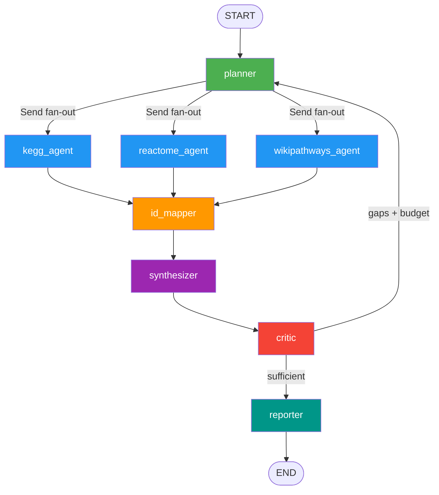

# LPS Signaling Pathway Pipeline — Architecture

## Overview

An agentic AI pipeline that systematically maps LPS (lipopolysaccharide)
intracellular signaling pathways by querying multiple pathway databases in
parallel, harmonizing gene IDs, building a unified network graph, and using
LLM-driven reflection to ensure biological completeness.

**LLM backend:** `agy` CLI (antigravity) — called via subprocess  
**Orchestration:** LangGraph StateGraph  
**Databases:** KEGG, Reactome, WikiPathways  
**ID mapping:** MyGene.info  

---

## Agentic Design Patterns Applied

| Pattern | Chapter | Where Used |
|---|---|---|
| Prompt Chaining | Ch.1 | Sequential nodes: planner → id_mapper → synthesizer → critic → reporter |
| Parallelization | Ch.3 | Three DB agents run simultaneously via LangGraph `Send` fan-out |
| Reflection | Ch.4 | Critic evaluates coverage; re-triggers planner if gaps remain |
| Tool Use | Ch.5 | Each API endpoint wrapped as a callable tool function |
| Planning | Ch.6 | Planner generates structured search strategy from biological query |
| Multi-Agent | Ch.7 | Specialist nodes: planner, 3×DB agents, id_mapper, synthesizer, critic, reporter |

---

## Graph Topology



---

## State Schema

```python
class PipelineState(TypedDict):
    query: str                                        # user biological question
    search_terms: List[str]                           # planner → DB agents
    plan: str                                         # planner narrative
    iteration: int                                    # reflection counter

    raw_pathways: Annotated[List[PathwayEntry],       # accumulates via operator.add
                            operator.add]             # ← fan-in reducer (Ch.3)

    id_mapping: Dict[str, Dict]                       # symbol → {entrez, uniprot, ensembl}
    nodes: List[Dict]                                 # unified graph nodes
    edges: List[Dict]                                 # gene–pathway edges
    hub_genes: List[str]                              # genes in ≥2 databases
    db_coverage: Dict[str, int]                       # pathways per database

    coverage_assessment: str                          # critic LLM evaluation
    coverage_gaps: List[str]                          # missing components
    additional_search_terms: List[str]                # gap-filling terms

    report: str                                       # final markdown report
    output_files: List[str]                           # paths to saved files
```

**Key design:** `raw_pathways` uses `operator.add` as a reducer.
When parallel agents each return `{"raw_pathways": [...]}`, LangGraph
appends all results into one list — this is the fan-in mechanism for Ch.3.

---

## Node Descriptions

### `planner` (LLM via agy)
- **Iteration 0:** Reads the user query, generates 6-10 biological search terms
  targeting TLR4 receptor, MyD88/TRIF adaptors, kinase cascades, TFs, disease contexts.
- **Iteration >0:** Reads `coverage_gaps` from critic, generates gap-filling terms only.

### `kegg_agent` / `reactome_agent` / `wikipathways_agent` (Pure API, no LLM)
- Run in **parallel** via LangGraph `Send` fan-out.
- Each calls its database REST API with the current `search_terms`.
- Returns `{"raw_pathways": [...]}` — appended to shared state.

### `id_mapper` (Pure API, no LLM)
- Deduplicates accumulated pathways on `(source, pathway_id)`.
- Batch-queries MyGene.info for all unique gene symbols.
- Returns unified `id_mapping: {symbol → {entrez, uniprot, ensembl}}`.

### `synthesizer` (Pure Python, no LLM)
- Builds a bipartite NetworkX graph: gene nodes ↔ pathway nodes.
- Edge attributes carry the source database (provenance).
- Identifies **hub genes**: genes appearing in pathways from ≥2 databases.
- Serializes graph to JSON-serializable `nodes` + `edges` lists.

### `critic` (LLM via agy — Ch.4 Reflection)
- Compares found pathways against a curated checklist of 12 required LPS components.
- Produces structured JSON: `coverage_assessment`, `missing_components`, `is_sufficient`.
- Routing: if `missing_components` non-empty AND `iteration ≤ MAX_REFLECTIONS` → back to planner.

### `reporter` (LLM via agy + pandas I/O)
- Saves four files to `results/<timestamp>/`:
  - `pathways.tsv` — all pathways with gene lists
  - `hub_genes.tsv` — cross-database hub genes with unified IDs
  - `network_edges.tsv` — edge list for Cytoscape / NetworkX visualization
  - `report.md` — LLM-generated narrative report
  - `pipeline_state.json` — reproducibility snapshot

---

## Data Flow Detail

```
User Query
   │
   ▼
planner ──(agy LLM)──► search_terms + plan
   │
   │ Send (parallel fan-out)
   ├──► kegg_agent ──► KEGG REST API ──► PathwayEntry list
   ├──► reactome_agent ──► Reactome ContentService ──► PathwayEntry list
   └──► wikipathways_agent ──► WikiPathways API ──► PathwayEntry list
                                    │
                   (operator.add reducer merges all three)
                                    │
                                    ▼
                               raw_pathways (accumulated)
                                    │
                               id_mapper ──► MyGene.info API
                                    │
                               synthesizer ──► NetworkX graph
                                    │
                               critic ──(agy LLM)──► coverage assessment
                                    │
                    ┌───────────────┤
                    │ gaps remain   │ sufficient
                    ▼               ▼
                 planner         reporter ──(agy LLM)──► report.md
              (next iteration)       │
                                     └──► pathways.tsv
                                     └──► hub_genes.tsv
                                     └──► network_edges.tsv
```

---

## LPS Biology Coverage Checklist

The critic agent checks these 12 required components:

1. TLR4/MD-2 receptor complex
2. MyD88-dependent pathway
3. TRIF/TICAM1-dependent pathway
4. IRAK1/IRAK4 kinase cascade
5. TRAF6 ubiquitin ligase
6. TAK1 (MAP3K7) activation
7. NF-κB canonical pathway
8. MAPK cascade (ERK, JNK, p38)
9. IRF3 / type I interferon response
10. PI3K/Akt pathway
11. Negative regulators (IRAK-M, TOLLIP, SOCS1)
12. LPS endosomal signaling (TLR4 internalization → TRIF activation)

---

## How to Run

```bash
cd ~/gdrive/01_Going_Projects/LPS_signaling_pathway

# 1. Create and activate virtual environment (one-time setup)
python3 -m venv .venv
source .venv/bin/activate          # macOS / Linux
# .venv\Scripts\activate           # Windows

# 2. Install dependencies into the venv
pip install -r requirements.txt

# 3. Run with default query
python -m scripts.main

# 4. Run with custom query
python -m scripts.main --query "LPS-induced NF-kB and IRF3 in human monocytes"

# 5. Show pipeline graph topology
python -m scripts.main --visualise

# 6. Outputs are saved to results/<timestamp>/
ls results/

# Deactivate venv when done
deactivate
```

---

## File Structure

```
LPS_signaling_pathway/
├── requirements.txt
├── docs/
│   ├── agentic-ai_tutorial.md    ← design patterns overview
│   └── architecture.md           ← this file
├── scripts/
│   ├── config.py                 ← constants, paths, DB URLs
│   ├── state.py                  ← LangGraph PipelineState TypedDict
│   ├── llm.py                    ← agy CLI wrapper (call_agy, call_agy_json)
│   ├── tools/
│   │   ├── kegg_tools.py         ← KEGG REST API
│   │   ├── reactome_tools.py     ← Reactome ContentService API
│   │   ├── wikipathways_tools.py ← WikiPathways API v2
│   │   └── id_mapping_tools.py   ← MyGene.info batch ID mapping
│   ├── agents/
│   │   ├── planner.py            ← search strategy generation (agy)
│   │   ├── db_agents.py          ← parallel KEGG/Reactome/WP nodes
│   │   ├── id_mapper.py          ← gene ID harmonization
│   │   ├── synthesizer.py        ← NetworkX graph construction
│   │   ├── critic.py             ← coverage reflection + routing (agy)
│   │   └── reporter.py           ← output files + narrative report (agy)
│   ├── graph/
│   │   └── pipeline.py           ← LangGraph StateGraph assembly
│   └── main.py                   ← CLI entry point
└── results/
    └── <timestamp>/
        ├── pathways.tsv
        ├── hub_genes.tsv
        ├── network_edges.tsv
        ├── report.md
        └── pipeline_state.json
```

---

## Extending the Pipeline

**Add a new database (e.g., STRING PPI):**
1. Create `scripts/tools/string_tools.py` with `fetch_lps_pathways()`
2. Add `string_agent_node` in `scripts/agents/db_agents.py`
3. Register node + edges in `scripts/graph/pipeline.py`
4. Add `Send("string_agent", state)` in `_dispatch_to_db_agents()`

**Add a new LPS component to the checklist:**
Edit `REQUIRED_LPS_COMPONENTS` in `scripts/agents/critic.py`.

**Increase reflection iterations:**
Set `LPS_MAX_REFLECTIONS=3` (default: 2).
